# Drón Rendszermodell Dokumentáció

## Tartalomjegyzék
1. [Stakeholder-elemzés](#stakeholder-elemzés)  
2. [Használati esetek (Use Case)](#használati-esetek-use-case)  
3. [Rendszer kontextus (BDD & IBD)](#rendszer-kontekstus-bdd--ibd)  
4. [Funkcionális követelmények (FR)](#funkcionális-követelmények-fr)  
5. [Nem-funkcionális követelmények (NFR)](#nem-funkcionális-követelmények-nfr)  
6. [Platformarchitektúra](#platformarchitektúra)  
7. [Funkcionális architektúra & interfészek](#funkcionális-architektúra--interfészek)  
8. [Részletes aktivitásdiagram](#részletes-aktivitásdiagram)  
9. [Platformmodellek](#platformmodellek)  
   - [BDD](#bdd-block-definition-diagram)  
   - [IBD](#ibd-internal-block-diagram)  
10. [Platform Specifikus Funkciók](#platform-specifikus-funkciók)  
11. [Platform Funkciók hozzárendelése](#platform-funkciók-hozzárendelése)  
12. [Konfigurált Platform Elemei](#konfigurált-platform-elemei)  
13. [Komponens-funkció nézet](#komponens-funkció-nézet)  
14. [Állapotgép-diagram](#állapotgép-diagram)  
15. [Tervezési döntések indoklása](#tervezési-döntések-indokolása)  
16. [Hibamód és -hatás analízis](#hibamód-és--hatás-analízis)  
17. [Teljesítményanalízis](#teljesítményanalízis)  
18. [Tesztelés és szimuláció](#tesztelés-és-szimuláció)  

---

## Stakeholder-elemzés
| Stakeholder                        | Érdekek / igények                                                                              |
|------------------------------------|-----------------------------------------------------------------------------------------------|
| **Ügyfél (Customer)**              | Megbízhatóság, pontosság, biztonság, hatékonyság; könnyű integráció a logisztikába             |
| **Versenytársak (Competition)**    | Versenyképesség: nagy hatótáv, gyors fordulóidő, alacsony költség                              |
| **Légiforgalmi felügyelet (ATC)**  | Repülési terv jóváhagyása, vészhelyzeti üzenetek, szabályok betartása, titkosított kommunikáció |
| **Operátorok (Operators)**         | Valós idejű telemetria, manuális átvétel, felhasználóbarát felület, minimális tréning           |
| **Földi személyzet (Ground Crew)** | Akkucsere/töltés, automatikus csomagkezelés, egyszerű karbantartás, diagnosztikai visszajelzés  |

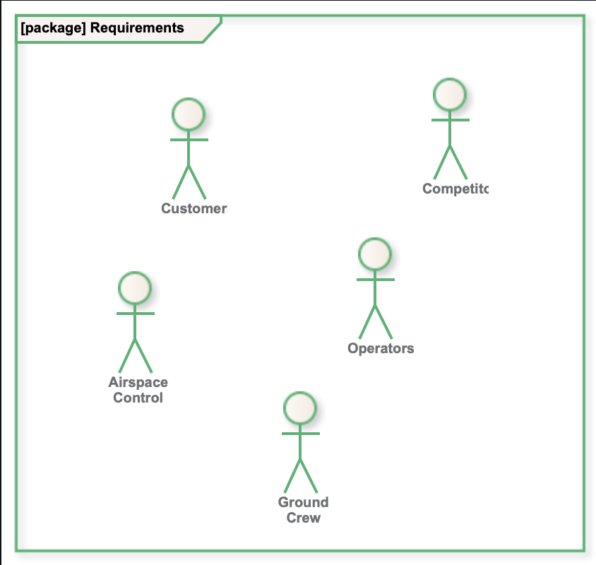

---

## Használati esetek (Use Case)
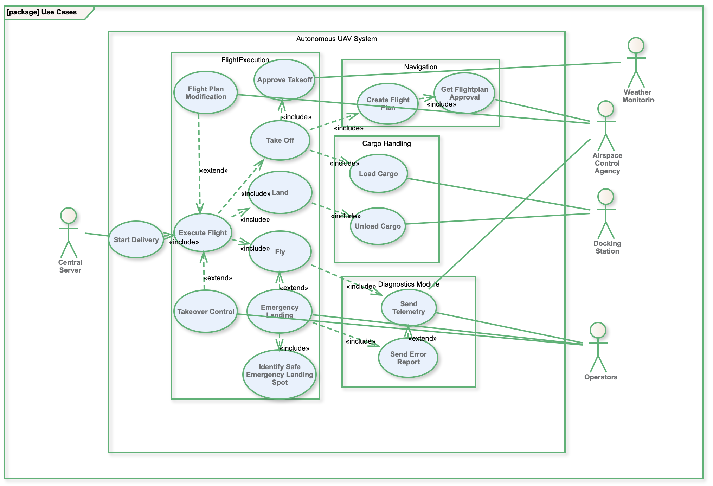

### Fő használati esetek
| Use Case                    | Aktor(ok)        | Rövid leírás                                   |
| --------------------------- | ---------------- | ---------------------------------------------- |
| **Start Delivery**          | Central Server   | Új szállítási megbízás indítása                |
| **Execute Flight**          | Autónóm rendszer | Repülés végrehajtása felszállástól leszállásig |
| ├─ Take Off                 |                  | VTOL felszállás (FR2.0)                        |
| ├─ Fly                      |                  | Útvonal követése, navigáció (FR1.1)            |
| ├─ Land                     |                  | Leszállás                                      |
| ├─ Flight Plan Modification |                  | Útvonal módosítása menet közben (extend)       |
| ├─ Takeover Control         | Operators        | Manuális irányítás átvétele (extend, FR6.1)    |
| ├─ Emergency Landing        | Autónóm rendszer | Vészhelyzeti leszállás (extend, FR6.0)         |
| │  └─ Identify Safe Spot    |                  | Biztonságos kényszerleszállóhely kiválasztása  |
| ├─ Send Telemetry           | Diagnostics      | Telemetriai adatok küldése (FR5.0)             |
| └─ Send Error Report        | Diagnostics      | Hibajelentés vészhelyzet esetén                |
| **Create Flight Plan**      | Navigation       | Repülési terv előállítása (include)            |
| **Get Flightplan Approval** | Airspace Control | Repülési terv jóváhagyása (FR 8.0)             |
| **Load Cargo**              | Docking Station  | Csomag be-/kirakodás (FR3.0)                   |
| **Unload Cargo**            | Docking Station  | Csomag kirakodása                              |

---

## Rendszer kontextus (BDD & IBD)

### Rendszerkontextus BDD
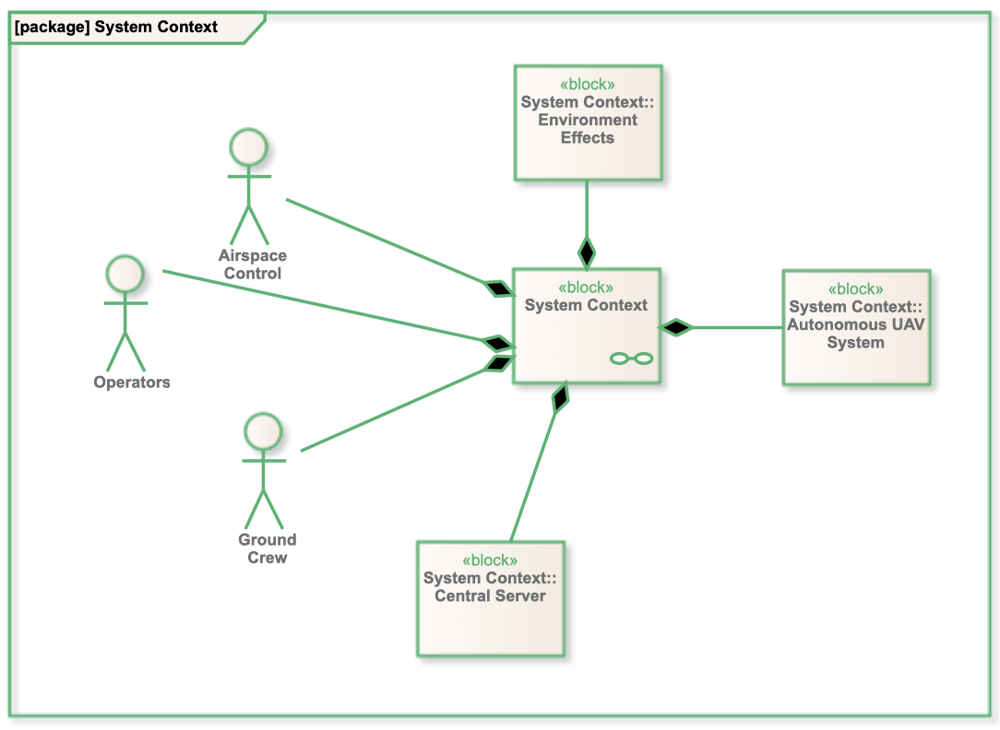

### Rendszerkontextus IBD
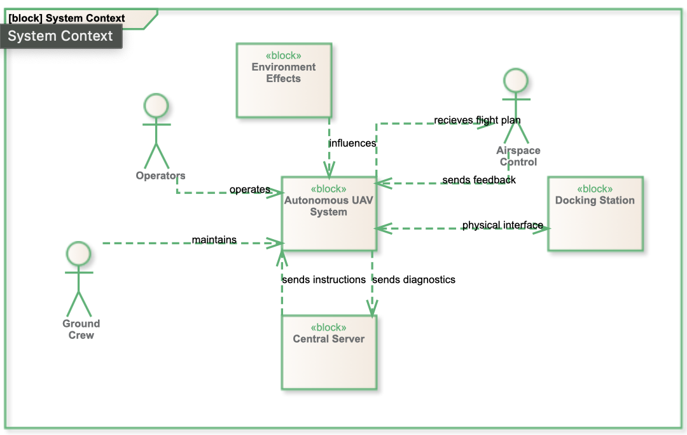
#### Leírás
A rendszerünk közvetlen kontextusába tartoznak az azt kezelő *operátorok*, akik olyan feladatokat látnak el, mint a vészhelyzetek kezelése (manuális irányítás átvétele), vagy esetleg a repülési tervek kézi elfogadása. Emellett ide tartozik még a releváns *légtérirányítási szervezet*, mellyel rendszerünk folyamatosan kommunikál, hogy a repülés a megfelelő törvényeket és előírásokat betartva történhessen. Ők fogadnak el minden repülési tervet, és menet közben is kényszeríthetik a járművet annak megváltoztatására, vagy a kényszerleszállásra. Ezen kívül ide tartoznak még a *földi személyzet* tagjai, akik a karbantartásért felelősek. A rendszer természetesen kommunikál még a *központi szerverünkkel*, így kapja meg a kiszállítási utasításokat, és ide küldi a diagnosztikai adatokat is. A *dokkolóállomásokkal* fizikai kapcsolatba lép minden egyes leszálláskor, a *környezeti hatások* pedig minden repülését meghatározzák. Nem szállhat fel például esős időben (NFR3.2).
#### Fő kapcsolatok
| Forrás                 | Cél                      | Kapcsolat típusa        |
|------------------------|--------------------------|-------------------------|
| Operators              | Autonomous UAV System    | operates                |
| Ground Crew            | Autonomous UAV System    | maintains               |
| Autonomous UAV System  | Central Server           | sends diagnostics       |
| Central Server         | Autonomous UAV System    | sends instructions      |
| Autonomous UAV System  | Airspace Control         | receives plans/feedback |
| Autonomous UAV System  | Docking Station          | physical interface      |
| Environment Effects    | Autonomous UAV System    | influences              |

---

## Funkcionális követelmények (FR)
| ID        | Követelmény leírás                                                 |
| --------- | ------------------------------------------------------------------ |
| **FR1.0** | Autonóm küldetésvégrehajtás, még kommunikáció-kimaradás esetén is. |
| **FR1.1** | Autonóm navigáció és repülésvezérlés az útvonal teljes hosszán.    |
| **FR2.0** | Függőleges fel- és leszállás.                                      |
| **FR3.0** | Automatikus csomag be-/kirakodás dokkoló állomáson.                |
| **FR3.1** | Fizikai és adat interfész a dokkolóhoz.                            |
| **FR4.0** | Küldetésadatok fogadása és státuszjelentések küldése.              |
| **FR4.1** | Misszió részleteinek (cél, csomagmetaadat) fogadása.               |
| **FR4.2** | Állapotfrissítések rendszeres küldése.                             |
| **FR5.0** | Diagnosztikai telemetria küldése.                                  |
| **FR5.1** | Telemetria tartalma: pozíció, orientáció, akkumulátor, hibakódok.  |
| **FR5.2** | Telemetria minimum 1 Hz.                                           |
| **FR6.0** | Vészhelyzeti kényszerleszállás egy 5×5 m-es sík felületen.         |
| **FR6.1** | Manuális irányítás átvétele bármikor.                              |
| **FR7.0** | Fordulóidő (csomagcsere, töltés, előkészítés) ≤ 20 perc.           |
| **FR8.0** | Titkosított légügyi kommunikáció repülési tervre és vészhelyzetre. |

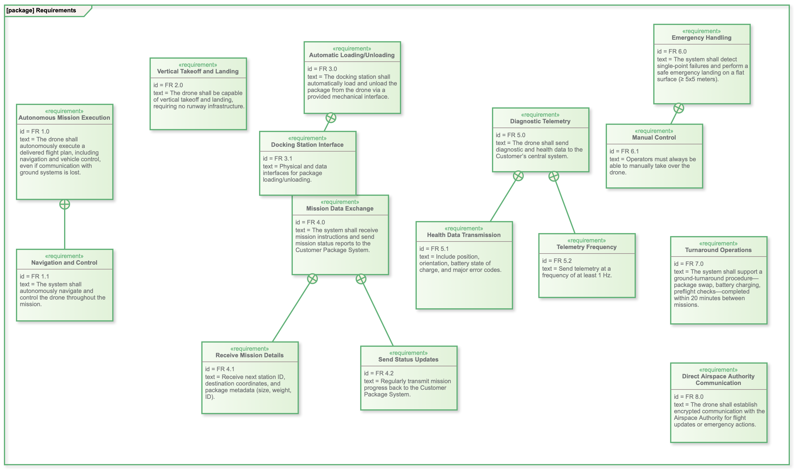

---

## Nem-funkcionális követelmények (NFR)
| ID         | Követelmény leírás                                                                                             |
| ---------- | -------------------------------------------------------------------------------------------------------------- |
| **NFR1.0** | Általános teljesítményjellemzők (teljesítmény, sebesség, hatótáv, magasság).                                   |
| **NFR1.1** | A drón egyetlen akkumulátortöltéssel ≥ 25 km távolságot képes megtenni.                                        |
| **NFR1.2** | A drón nem lépheti túl a 200 m magasságot (AGL) a repülés során.                                               |
| **NFR2.0** | Csomag- és drónméretekre vonatkozó fizikai korlátok: csomagsúly, méret és drónkontúr.                          |
| **NFR2.2** | Maximális csomagméretek: 250 × 150 × 140 mm.                                                                   |
| **NFR2.3** | Maximális csomagsúly: ≤ 3 kg.                                                                                  |
| **NFR2.4** | Drónkontúr: illeszkedjen egy 2 m átmérőjű és 1 m magasságú hengerbe.                                           |
| **NFR2.5** | A tervezés során figyelembe kell venni a környezeti hatásokat (pl. szél, hőmérséklet, csapadék).               |
| **NFR3.0** | Megbízhatóság és rendelkezésre állás: a rendszer megbízhatóan üzemeljen a meghatározott körülmények között.    |
| **NFR3.1** | Az avionikai rendszer ≤ 3 másodperc alatt újrainduljon (reboot).                                               |
| **NFR3.2** | Esőben a megkezdett küldetést be kell fejezni, de felszállni nem szabad.                                       |
| **NFR3.3** | Vizuális előellenőrzés repülés előtt és részletes havi karbantartási/ellenőrzési ciklus.                       |
| **NFR3.4** | A repülési tervek kerüljék a tiltott zónákat, és maradjanak 10 m-es folyosón belül.                            |
| **NFR4.0** | Biztonság és megfelelőség: minden kommunikáció biztonságos (titkosított), és feleljen meg a jogi előírásoknak. |
| **NFR4.1** | Az összes adatátvitel (misszió-, vész- és telemetriaüzenetek) titkosítva történjen.                            |
| **NFR4.2** | Meg kell felelni a nemzeti és légteret szabályozó hatósági előírásoknak.                                       |
| **NFR4.3** | A repülési terveket a hatóság jóvá kell, hogy hagyja, és azok módosíthatók legyenek.                           |
| **NFR5.0** | Képzési követelmények: minimális tréning a földi személyzet és operátorok számára.                             |
| **NFR5.1** | A földi személyzet képzése ne haladja meg az 1 napot.                                                          |
| **NFR5.2** | Az operátoroknak legyenek meg a minimális technikai ismeretei a rendszer biztonságos működtetéséhez.           |

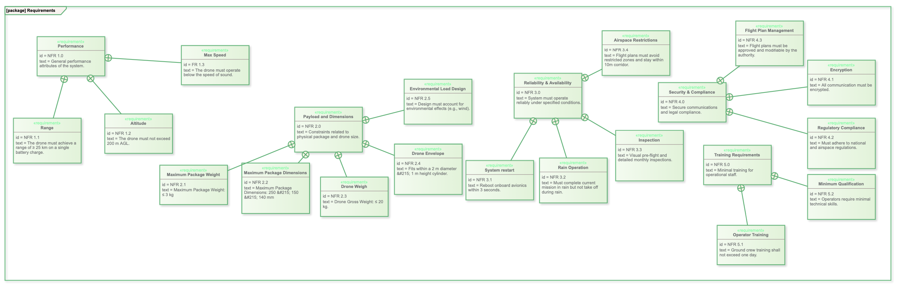

---

## Funkcionális architektúra & interfészek
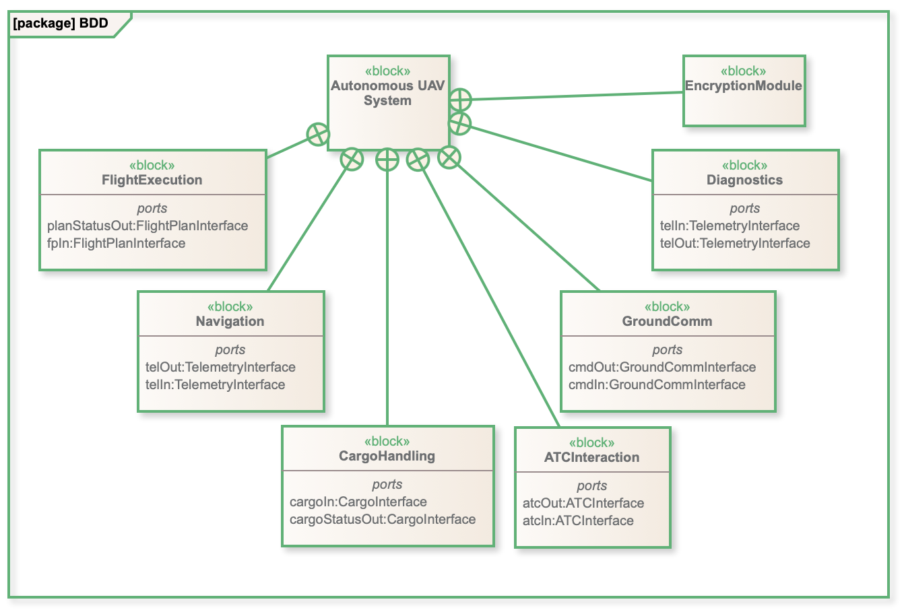  
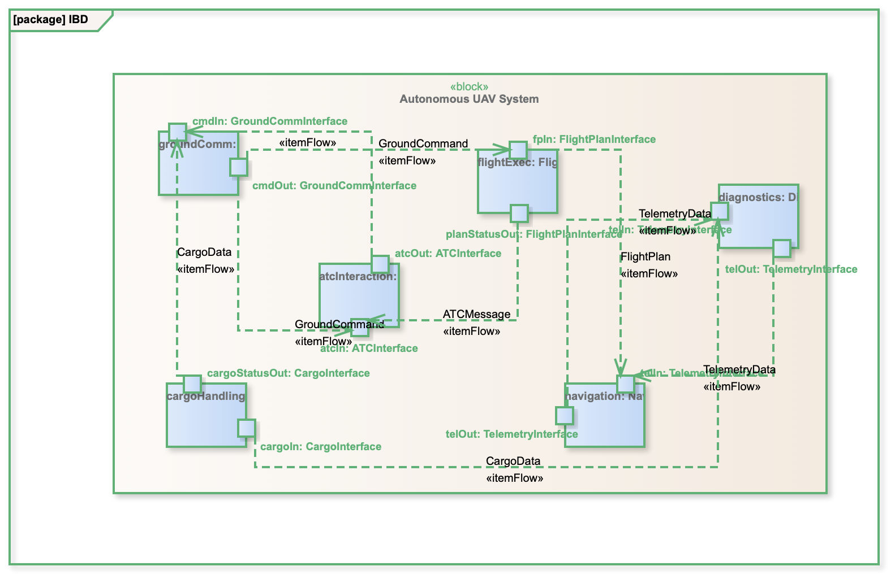

| Modul                | Feladat                                                          |
| -------------------- | ---------------------------------------------------------------- |
| **FlightExecution**  | Felszállás, waypoint-követés, leszállás                          |
| **Navigation**       | Repülési terv kezelése, helymeghatározás, telemetria előkészítés |
| **CargoHandling**    | Automatikus csomag be-/kirakodás, csomag verifikálása            |
| **GroundComm**       | Kétirányú parancs- és státuszkommunikáció                        |
| **ATCInteraction**   | Repülési terv jóváhagyása, vész-ATC üzenetek                     |
| **Diagnostics**      | Rendszer-egészség ellenőrzése, hibajelentés                      |
| **EncryptionModule** | Kommunikáció titkosítása                                         |

---

## Részletes aktivitásdiagram
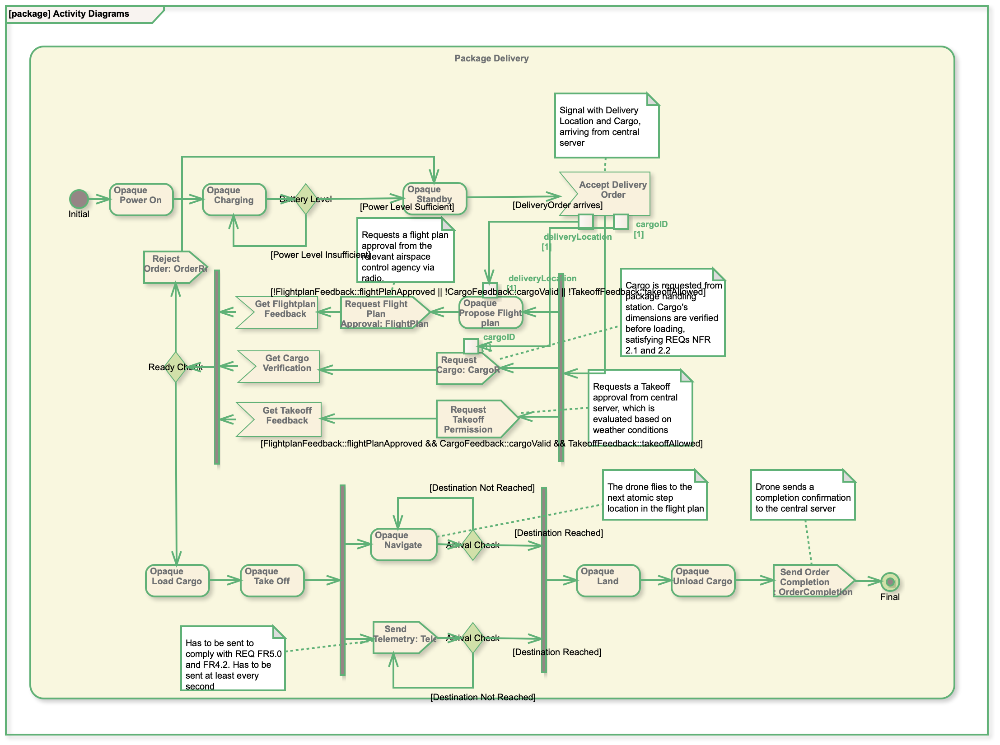

1. **Initial → Power On → Charging**  
2. **[Power ≥ küszöb?]** → Reject Order / Standby  
3. **Accept Delivery Order** (cél, cargoID)  
4. **Paralelizált előkészítés**  
   - Flight Plan Approval ←→ ATC (FR8.0)
   - Cargo Verification ←→ Docking Station (NFR 2.0)
   - Takeoff Permission ←→ Central Server  (NFR 3.2)
1. **Ready Check** (mindhárom ✔️)  
2. **Load Cargo → Take Off → Navigate & Send Telemetry**  
3. **[Destination Reached?]** → Land → Unload Cargo → Send Order Completion → Final  

---

## Platformmodellek  

### BDD (Block Definition Diagram)  
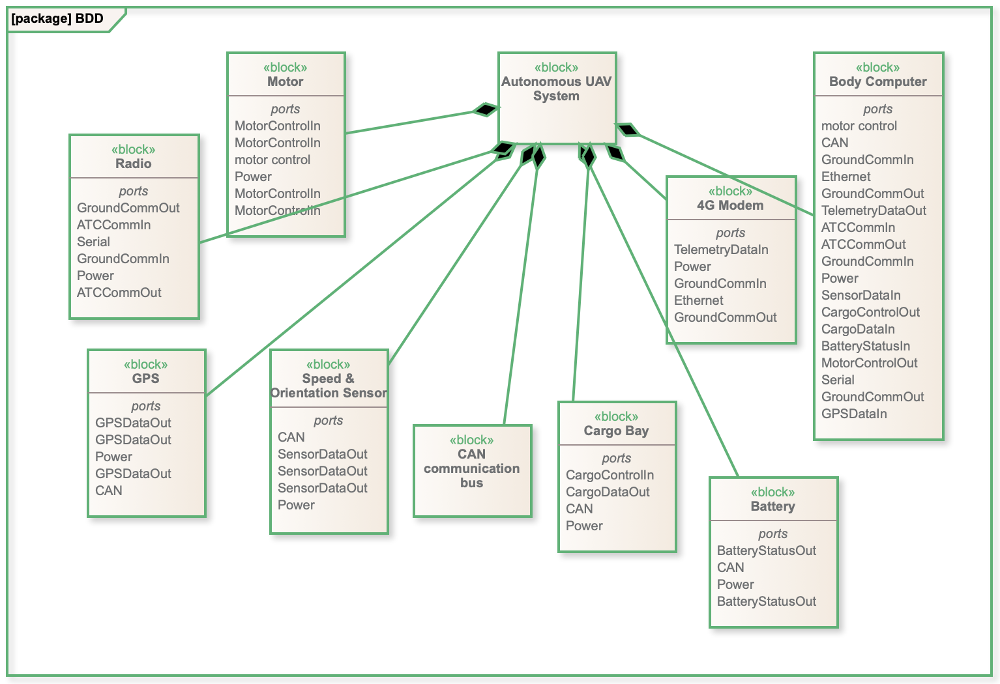  
A blokk-definíciós diagram (BDD) az autonóm drón fizikai platformjának főbb hardverkomponenseit és azok viszonyát szemlélteti. A drón felépítéséhez tartozó blokkok:
- **Fedélzeti számítógép (Body Computer):** központi vezérlőegység a repülésirányítás és rendszerlogika számára  
- **Motorok:** négy rotor meghajtását biztosító egységek  
- **Rádió:** rövid hatótávú vezeték nélküli kommunikáció modul  
- **4G modem:** celluláris adatkapcsolat a központi szerverrel  
- **GPS modulok:** pozíció és sebesség meghatározása  
- **IMU szenzorok:** sebesség- és orientációs adatok szolgáltatása  
- **Rakományrekesz (Cargo Bay):** csomag rögzítése és kioldása  
- **Akkumulátorok:** fő és tartalék energiaforrások  
- **CAN busz:** belső kommunikációs hálózat az eszközök között  
Az egyes portok a blokkok külső interfészeit mutatják, például a tápellátást, adatvonalakat és vezérlőjelek fogadását/küldését.

### IBD (Internal Block Diagram)  
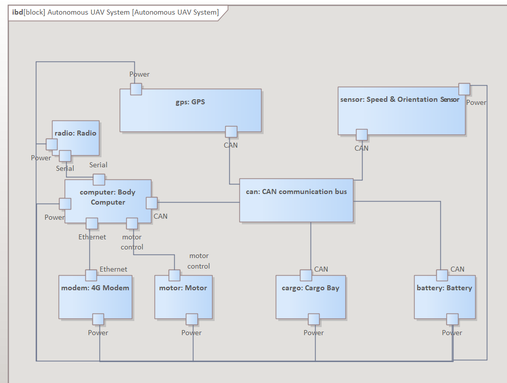  
Az IBD a platform fizikai alkatrészei közötti konkrét kapcsolódásokat ábrázolja. A CAN busz hálózaton keresztül a Body Computer kommunikál a szenzorokkal, rakományrekesszel és akkumulátorokkal, miközben dedikált vezérlővonalak (PWM vagy CAN üzenetek) irányítják a motorokat. A rádió és a 4G modem külön interfészeken (soros port, Ethernet/USB) csatlakoznak a fedélzeti számítógéphez, biztosítva a redundáns kommunikációt a földi vezérléssel. A fő akkumulátor látja el a rendszert, míg a tartalék akkumulátor vészhelyzeti kapacitást biztosít, és töltöttségi visszajelzéseit a BatteryStatus adatokkal közli a Body Computerrel.

---

## Platform Specifikus Funkciók  
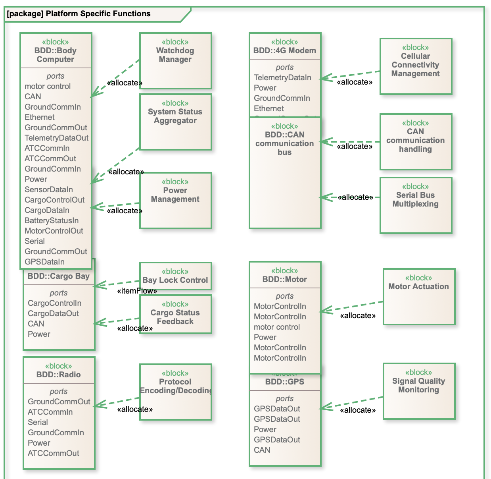  
A platform-specifikus funkciók diagramja a drón hardver komponenseihez rendelt beágyazott funkciókat mutatja be. A diagram a következő fő területeket tartalmazza:

1. **Fedélzeti Számítógép (Body Computer)**
   - Watchdog felügyelet
   - Rendszerállapot aggregáció

2. **Akkumulátor (Battery)**
	- Energiagazdálkodás

3. **Rakományrekesz (Cargo Bay)**
   - Rekeszzár vezérlés
   - Rakomány állapot-visszajelzés

3. **Kommunikációs Rendszerek**
   - Rádió: protokoll kódolás/dekódolás
   - 4G modem: mobil hálózati kapcsolat
   - CAN busz: belső kommunikáció kezelése, busz multiplexing

4. **Szenzorok és Vezérlés**
   - GPS modul: jelminőség monitorozás
   - Motorvezérlő: fordulatszám szabályozás
   - IMU szenzorok: orientáció és sebesség mérés

A diagram a <<allocate>> kapcsolatokon keresztül mutatja be, hogy mely funkciók mely hardver komponenseken futnak, segítve a rendszer architektúrájának megértését és optimalizálását.

---

## Platform Funkciók hozzárendelése  
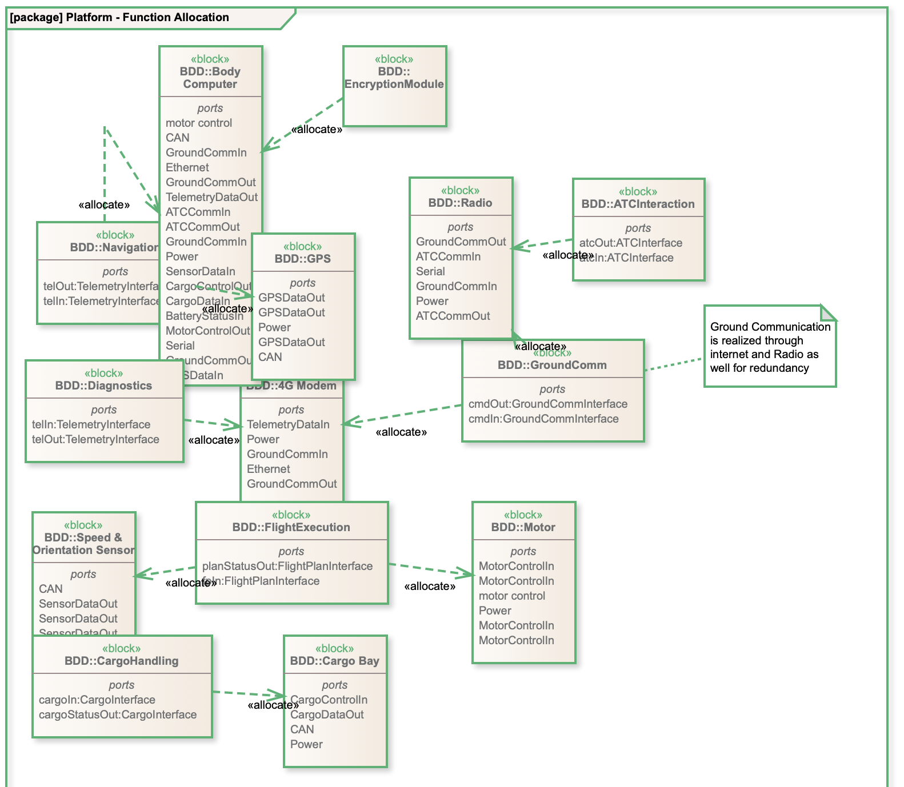  

A funkciók hozzárendelését bemutató diagram a rendszer fő funkcionális moduljainak és azok hardver komponensekhez való hozzárendelését mutatja be. A diagram a következő fő területeket tartalmazza:

1. **Fedélzeti Számítógép (Body Computer)**
   - Navigation modul
   - Encryption (titkosítási) modul (NFR8.0)
   - Diagnosztikai modul
2. **Motorok**
   - A FlightExecution a motorok vezérlőire allokált, de használja az IMU szenzorokat is.  

4. **Kommunikációs Rendszerek**
   - ATCInteraction: rádió hardveren
   - GroundComm: redundáns megvalósítás (4G modem + rádió)

4. **Rakománykezelés**
   - CargoHandling: Cargo Bay vezérlőjében

A diagram a funkciók és hardver komponensek közötti kapcsolatokat mutatja be, kiemelve a rendszer redundáns megvalósításait és a biztonsági szempontokat. A hozzárendelések optimalizálva vannak a teljesítmény, megbízhatóság és energiahatékonyság szempontjából.

---

## Konfigurált Platform Elemei  
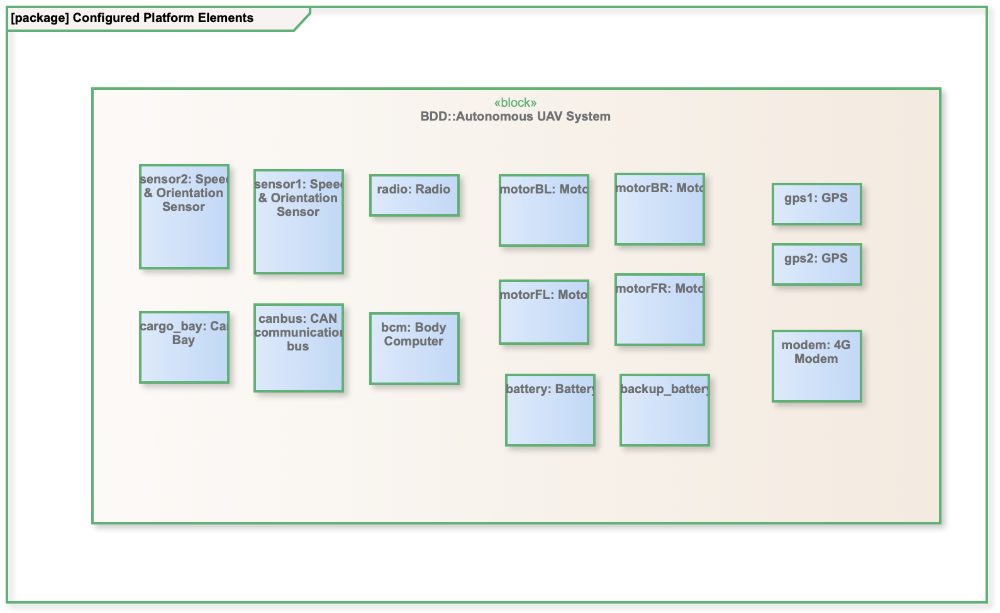  

A konfigurált platform elemek diagramja a drón fizikai komponenseinek konkrét példányait és azok kapcsolatait mutatja be. A diagram a következő fő területeket tartalmazza:

1. **Meghajtás és Vezérlés**
   - Négy motor (motorFL, motorFR, motorBL, motorBR)
   - Body Computer (bcm)
   - CAN busz kommunikációs hálózat

2. **Navigáció és Szenzorok**
   - Három GPS modul (gps1, gps2, gps3)
   - Három IMU szenzor (sensor1, sensor2, sensor3)
   - Szavazásos szenzorrendszer a megbízhatóság növelésére

3. **Kommunikáció**
   - Rádió modul
   - 4G modem
   - Redundáns kommunikációs csatornák

4. **Energia és Rakomány**
   - Fő akkumulátor
   - Tartalék akkumulátor
   - Rakományrekesz

A diagram a komponensek példányainak nevét és típusát is megmutatja, segítve a rendszer konkrét megvalósításának megértését és karbantartását. A redundáns komponensek (GPS, IMU, akkumulátor) a rendszer megbízhatóságát növelik.

---

## Komponens-funkció nézet  
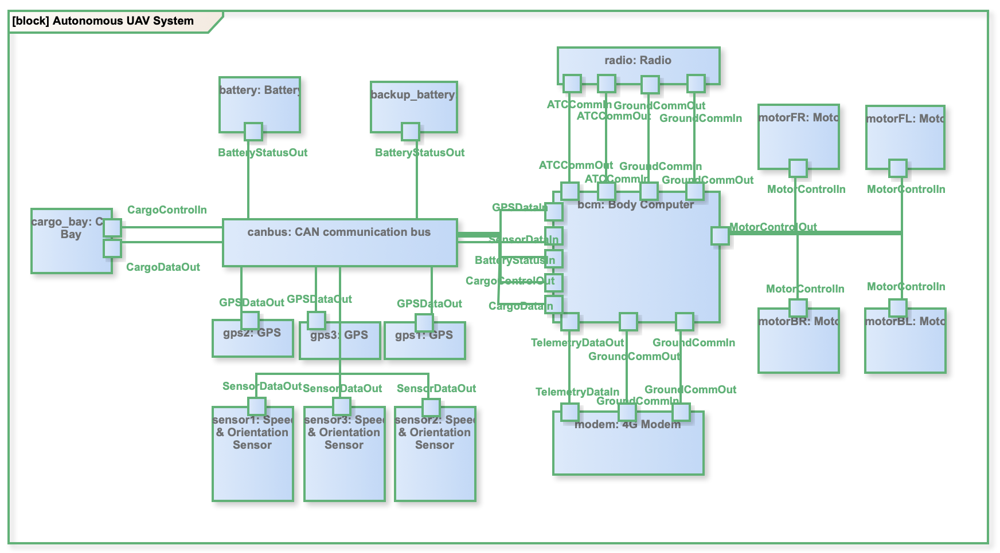  

A komponens-funkció nézet diagramja a rendszer működését mutatja be az IBD (Internal Block Diagram) alapján. A diagram a következő fő területeket tartalmazza:

1. **Központi Vezérlés és Adatkezelés**
   - Body Computer mint központi csomópont
   - SensorDataOut és GPSDataOut adatok fogadása a CAN buszról
   - MotorControlOut jelek továbbítása a motorvezérlőknek
   - GroundComm és ATCComm a Radio és 4G modem modulokon keresztül

2. **Energiagazdálkodás**
   - BatteryStatusOut/BatteryStatusIn portok
   - Dinamikus energiafelügyelet
   - Akkumulátor állapot monitorozás

3. **Kommunikációs Rendszer**
   - Rádió és 4G modem párhuzamos kapcsolódása
   - GroundComm és ATCComm interfészek
   - Redundáns kommunikációs csatornák
   - Titkosítási logika integrációja

4. **Adatfolyamok és Interfészek**
   - Szenzor adatok feldolgozása (szavazással)
   - Vezérlő jelek generálása
   - Telemetria adatok továbbítása
   - Biztonságos adatcsere

A diagram a rendszer komponensei közötti adatfolyamokat és interfészeket részletesen bemutatja, segítve a rendszer működésének megértését és optimalizálását.

---

## Állapotgép-diagram  
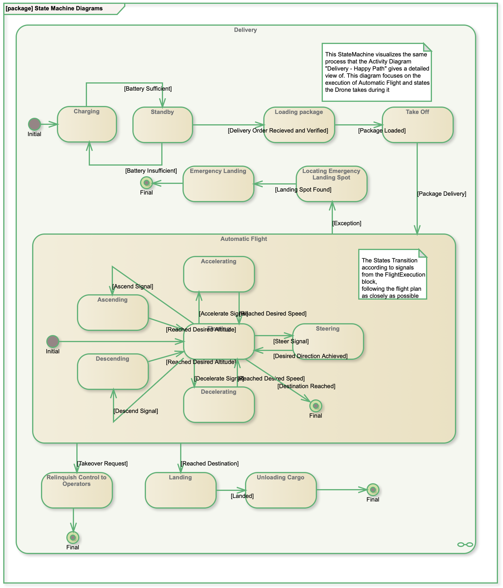  

A drón állapotgép-diagramja a csomagkézbesítés teljes folyamatát mutatja be állapotok és átmenetek segítségével. A diagram a következő fő területeket tartalmazza:

1. **Kezdeti Állapotok**
   - Töltés (Charging)
   - Standby (Készenlét)
   - Loading Package (Csomag betöltése)

2. **Repülési Állapotok**
   - Take Off (Felszállás)
   - Automatikus repülés alállapotai:
     - Ascending (Emelkedés)
     - Accelerating (Gyorsítás)
     - Steering (Irányítás)
     - Decelerating (Lassítás)
     - Descending (Süllyedés)

3. **Leszállás és Csomagkezelés**
   - Landing (Leszállás)
   - Unloading Cargo (Csomag kirakodása)
   - Final (Befejezés)

4. **Vészhelyzeti Állapotok**
   - Emergency Landing (Vészhelyzeti leszállás)
   - Relinquish Control to Operators (Operátoroknak való átadás)

A diagram a rendszer állapotait és azok közötti átmeneteket részletesen bemutatja, kiemelt fókusszal a repülés állapotain, segítve a rendszer működésének megértését és a vészhelyzetek kezelésének tervezését. A diagram tartalmazza a különböző eseményeket és feltételeket, amelyek az állapotátmeneteket vezérlik.

---

## Hibafa
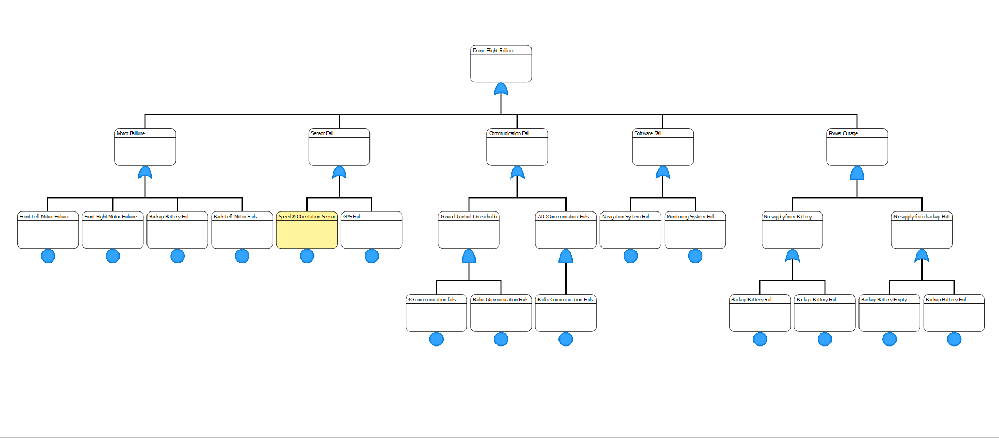  

A hibafa elemzés a drón rendszer kritikus hibáinak és azok okainak vizsgálatát mutatja be. A fa tetején a "Drone Flight Failure" esemény található, ami a rendszer teljes meghibásodását jelenti. A fa struktúrája a következő fő hibacsoportokat tartalmazza:

1. **Tápegység meghibásodás (Power Outage)**
   - Fő akkumulátor meghibásodása
   - Tartalék akkumulátor meghibásodása
   - Mindkét akkumulátor kiesése

2. **Szoftver meghibásodás (Software Fail)**
   - Navigációs rendszer meghibásodása
   - Monitorozó rendszer meghibásodása

3. **Kommunikációs meghibásodás (Communication Fail)**
   - Földi irányítás elérhetetlensége (4G és rádió meghibásodása)
   - Légiforgalmi irányítás elérhetetlensége (rádió meghibásodása)

4. **Szenzor meghibásodás (Sensor Fail)**
   - Sebesség és orientációs szenzorok meghibásodása
   - GPSek meghibásodása

A hibafa segítségével azonosíthatók a kritikus pontok a rendszerben, és megfelelő redundancia és biztonsági intézkedések tervezhetők a megbízhatóság növelésére.

---

## Tervezési döntések indokolása
| Döntés                             | Indoklás                                                                                       |
|------------------------------------|------------------------------------------------------------------------------------------------|
| **Redundáns GPS & IMU**            | Magas megbízhatóság, pontos navigáció (NFR3.4)                                                  |
| **4G + rádió**                     | Hosszú hatótávú + valós idejű vész/ATC kommunikáció                                             |
| **Telemetria 1 Hz**                | Folyamatos felügyelet, gyors reagálás (FR5.2)                                                   |
| **Autom. vészleszállás**           | Kényszerhelyzetek biztonságos kezelése (FR6.0)                                                  |
| **Manuális irányítás átvétele**     | Emberi beavatkozás vész és rendellenesség esetén (FR6.1)                                        |
| **Titkosított kommunikáció**       | Adatvédelem, illetéktelen lehallgatás megakadályozása (NFR4.1)                                  |
| **Autom. dokkoló & csomagkezelés** | Gyors fordulóidő ≤ 20 perc, kevesebb emberi hiba                                                |
| **VTOL képesség**                  | Infrastruktúra-mentes függőleges indítás/leszállás (FR2.0)                                      |
| **Környezeti terhelés figyelembe** | Szél- és csapadékkompenzáció, esőben repülés befejezése (NFR2.5, NFR3.2)                         |
| **Gyors reboot ≤ 3 s**             | Folyamatos repülés, hibatűrés kritikus szoftverhiba esetén (NFR3.1)                             |
| **1 nap képzés**                   | Felhasználóbarát HMI, gyors üzemeltetés (NFR5.1–5.2)                                            |

# Hibamód és -hatás analízis

## Tervezési Fázis

| Azonosító | Hiba Módja                                                                                             | Lehetséges Hiba Ok(ok)                                                                                                | Lehetséges Hatás(ok)                                                                                                                                                              | Súlyosság (S) [1-5] | Előfordulási Gyakoriság (O) [1-5] | Jelenlegi Detektálási Módszerek / Kontrollok (D) [1-5]                                  | Kockázati Prioritási Szám (RPN) | Javasolt Intézkedések / Fejlesztések                                                                                                                                                                                                                            | Felelős Személy / Csapat                  | Határidő                |
| :-------- | :----------------------------------------------------------------------------------------------------- | :-------------------------------------------------------------------------------------------------------------------- | :-------------------------------------------------------------------------------------------------------------------------------------------------------------------------------- | :------------------ | :--------------------------------- | :---------------------------------------------------------------------------------------------------------------------------------------------------------------------------------------------------- | :------------------------------ | :-------------------------------------------------------------------------------------------------------------------------------------------------------------------------------------------------------------------------------------------------------------- | :---------------------------------------- | :---------------------- |
| T-001     | Nem megfelelő aerodinamikai tervezés, a szélhatások nem kellően figyelembe véve.                         | Hiányos vagy pontatlan szimulációk, tervezési tapasztalat hiánya a specifikus drónméretre és súlyra, nem megfelelő szélcsatorna tesztek, a változó időjárási körülmények alulbecslése. | Instabil repülés, letérés az útvonalról (>10m), megnövekedett energiafogyasztás, irányíthatatlanság erős szélben, repülési terv megsértése, balesetveszély, biztonsági tanúsítvány megszerzésének kudarca. | 5                   | 3                                  | Tervezési felülvizsgálatok, CFD szimulációk, korai fázisú prototípus tesztek szélcsatornában. (D érték magasabb, mert a valós, komplex széllökések nehezen modellezhetők tökéletesen.)                     | 3                               | 45                              | Részletes, iteratív CFD analízis valósághű szélmodellekkel. Kiterjedt szélcsatorna tesztek különböző szélprofilokkal és széllökésekkel. Robusztus, adaptív vezérlő algoritmusok fejlesztése szélkompenzációra. Prototípus tesztelése valós, változatos időjárási körülmények között. | Tervező Mérnökök, Aerodinamikai Szakértő | Tervezési fázis vége    |
| T-002     | Az akkumulátor kapacitása alulméretezett a specifikált 25 km-es hatótávhoz (3kg csomaggal).               | Hibás számítások az energiafogyasztásra (pl. repülési profil, szél, eső hatása), az akkumulátor degradációjának figyelmen kívül hagyása, nem optimális akkumulátor technológia kiválasztása. | A drón nem tudja teljesíteni a 25 km-es utat, kényszerleszállást kell végrehajtania nem biztonságos helyen, csomag elvesztése/sérülése, küldetés sikertelensége, ügyfél elégedetlenség.     | 4                   | 3                                  | Laboratóriumi akkumulátor tesztek, energiafogyasztási szimulációk, kezdeti repülési tesztek. (D érték magasabb, mert a valós körülmények és a hosszútávú degradáció nehezen jósolható pontosan.) | 3                               | 36                              | Konzervatív energiafogyasztási modellek használata, beleértve a legrosszabb eshetőségeket (max. teher, max. szembeszél, eső). Tartalék kapacitás beépítése (pl. 20-25%). Valós repülési tesztek maximális terheléssel és kedvezőtlen körülmények között. Akkumulátor menedzsment rendszer (BMS) alapos tesztelése. | Tervező Mérnökök, Elektromos Rendszerekért Felelős Csapat | Prototípus tesztelési fázis |
| T-003     | A fedélzeti rendszer újraindulása meghaladja a specifikált 3 másodpercet.                               | Nem optimalizált boot folyamat, hardveres erőforrások szűkössége, szoftver komplexitása, nem megfelelő prioritáskezelés a rendszerindítás során.                                          | Kritikus helyzetben (pl. repülés közbeni hiba utáni automatikus újraindulás, operátori beavatkozás szükségessége) túl hosszú ideig tartó irányíthatatlanság, ami balesethez vezethet. Biztonsági előírások megsértése. | 4                   | 2                                  | Tesztpadon végzett rendszerindítási idő mérések, szoftver profilozás. (D érték alacsony, mert ez jól mérhető és reprodukálható.)                                                                     | 2                               | 16                              | A boot folyamat szoftveres és hardveres optimalizálása. Kritikus funkciók (pl. stabilizálás, alapvető vezérlés) gyorsabb elérhetőségének biztosítása. Gyorsabb processzor/memória fontolóra vétele. Rendszeres újraindítási idő tesztelése a fejlesztés minden szakaszában. | Szoftverfejlesztő Csapat, Hardver Tervező Csapat | Rendszerintegrációs teszt fázis |
| T-004     | A drón fizikai méretei vagy össztömege meghaladják a dokkolóállomás specifikációit (2m átmérő, 1m magasság, 20kg tömeg). | Tervezési hiba, a komponensek integrációja során fellépő váratlan méret/súly növekedés, a specifikációk félreértelmezése. | A drón nem képes dokkolni, a csomagfelvétel/leadás meghiúsul, a rendszer nem üzemeltethető a tervezett dokkolóállomásokkal. Költséges áttervezés szükségessége.                         | 4                   | 2                                  | CAD modellezés, súlybecslések, korai prototípus illesztési tesztek a dokkoló makettjével/specifikációjával. (D érték alacsony, mert ez jól ellenőrizhető a tervezés során.)                        | 1                               | 8                               | Folyamatos méret- és súlykontroll a tervezési és gyártási folyamat során. Szoros együttműködés a dokkolóállomást fejlesztő alvállalkozóval. Puffer hagyása a méretekben és súlyban a váratlan eltérések kezelésére. | Tervező Mérnökök, Projektmenedzsment | Tervezési felülvizsgálatok során |

## Üzemeltetési Fázis

| Azonosító | Hiba Módja                                                                                               | Lehetséges Hiba Ok(ok)                                                                                                                                | Lehetséges Hatás(ok)                                                                                                                                                                                             | Súlyosság (S) [1-5] | Előfordulási Gyakoriság (O) [1-5] | Jelenlegi Detektálási Módszerek / Kontrollok (D) [1-5]                                                                         | Kockázati Prioritási Szám (RPN) | Javasolt Intézkedések / Fejlesztések                                                                                                                                                                                                                                                           | Felelős Személy / Csapat                          | Határidő                     |
| :-------- | :------------------------------------------------------------------------------------------------------- | :---------------------------------------------------------------------------------------------------------------------------------------------------- | :--------------------------------------------------------------------------------------------------------------------------------------------------------------------------------------------------------------- | :------------------ | :--------------------------------- | :------------------------------------------------------------------------------------------------------------------------------------------------------------------------------------------------------------- | :------------------------------ | :------------------------------------------------------------------------------------------------------------------------------------------------------------------------------------------------------------------------------------------------------------------------------------------------ | :---------------------------------------------- | :--------------------------- |
| U-001     | Kommunikációs hiba az autonóm drón és a földi állomás között repülés közben (adatkapcsolat megszakadása).   | Rádiófrekvenciás interferencia, a drón hatótávon kívül kerül, a kommunikációs modul meghibásodása (drónon vagy földi állomáson), környezeti árnyékolás (pl. épületek), földi állomás áramkimaradása. | Az operátor nem tud beavatkozni. A drónnak autonóm módon kell folytatnia a repülési tervet (specifikáció szerint). Ha az autonóm rendszer is hibásodik, irányíthatatlanság, baleset. Telemetria és távirányítás ideiglenes elvesztése. | 4                   | 3                                  | A rendszer automatikusan jelzi a kapcsolat elvesztését. A drón autonóm repülési képessége. (D érték alacsony a detektálás szempontjából, de a következmények súlyosak lehetnek.)                                              | 1                               | 12                              | Robusztus autonóm repülési protokollok ("lost link procedures") biztosítása adatkapcsolat elvesztése esetére. Redundáns kommunikációs csatornák (pl. eltérő frekvencia, technológia) fontolóra vétele. A kommunikációs rendszer rendszeres ellenőrzése. Földi állomások optimális telepítése és karbantartása. | Üzemeltetési Csapat, Hálózattechnikai Szakértők | Folyamatos (üzemeltetés során) |
| U-002     | Telemetriai adatok (pozíció, akkumulátor, hibakódok) küldésének elmulasztása, hibás vagy nem kellő gyakoriságú (<1/sec) küldése. | Szenzorhiba (GPS, IMU, akku szenzor), fedélzeti számítógép szoftverhiba, kommunikációs modul hiba, adatfeldolgozási hiba a drónon, titkosítási hiba.                                 | A földi irányítás nem kap valós idejű információt a drón állapotáról. A drón követése nehezített/lehetetlen. Késedelmes hibafelismerés. Operátori beavatkozás hatékonysága csökken. Légtérfelügyeleti előírások megsértése.       | 5                   | 2                                  | A monitorozó rendszer észleli az adatok hiányát vagy inkonzisztenciáját. Riasztások generálása. (D érték közepes, mert az ok felderítése időt vehet igénybe.)                                                              | 2                               | 20                              | Redundáns szenzorok fontolóra vétele kritikus adatokhoz (pl. GPS). A telemetriai alrendszer alapos, végponttól végpontig tesztelése. Fedélzeti diagnosztika, amely jelzi a telemetriai rendszer belső hibáit. Szigorú szoftverminőség-biztosítás. Adatvalidáció a földi rendszerben.                       | Szoftverfejlesztő Csapat, Üzemeltetési Csapat     | Folyamatos (üzemeltetés során) |
| U-003     | A drón letér a repülési terv által meghatározott útvonaltól (a 10 méteres korridor elhagyása).              | Erős, váratlan széllökés, GPS jelvesztés/pontatlanság (pl. "urban canyon" effektus), navigációs szoftver hiba, vezérlőrendszer hibája, hibás repülési terv feltöltése, IMU drift.                 | Légtérfelügyeleti előírások megsértése, potenciális összeütközés veszélye más légijárművekkel (bár ezt a légtérfelügyelet is monitorozza), küldetés sikertelensége, hatósági bírság, a cég jó hírének csorbulása.         | 4                   | 2                                  | A monitorozó rendszer és a légtérfelügyelet valós időben észleli az útvonalelhagyást. Automatikus riasztások. (D érték alacsony.)                                                                                    | 1                               | 8                               | Precíz GPS (RTK képes) és magas minőségű inerciális navigációs rendszer (INS) kombinációja. Robusztus útvonalkövető algoritmusok szél- és egyéb zavaró tényezők kompenzálásával. Rendszeres GPS/INS kalibráció. A repülési terv validálása feltöltés előtt. Vészhelyzeti protokoll útvonalelhagyás esetére. | Üzemeltetési Csapat, Szoftverfejlesztő Csapat     | Folyamatos (üzemeltetés során) |
| U-004     | A drón nem képes befejezni a megkezdett küldetést, ha repülés közben eső kezdődik.                          | Nem megfelelő vízállóság (IP védettség alacsonyabb a szükségesnél), elektronikai komponensek beázása, motorok/propellerek teljesítménycsökkenése esőben, szenzorok (pl. kamera, lidar) hibás működése esőben. | Küldetés megszakítása, kényszerleszállás, csomag esetleges sérülése, ügyfél elégedetlenség. A drón károsodása.                                                                                                    | 3                   | 2                                  | Repülés előtti időjárás ellenőrzés (felszállás nem engedélyezett esőben). A drón állapotának monitorozása. (D érték közepes, mert a fokozatos beázás nem mindig azonnal detektálható.)                               | 3                               | 18                              | Megfelelő IP védettségi szint biztosítása a drón burkolatán és a kritikus komponenseken. Esőtesztek elvégzése a tervezési fázisban. Olyan szenzorok választása, melyek esőben is megbízhatóan működnek, vagy védelmük biztosítása. Vészhelyzeti protokoll kidolgozása arra az esetre, ha repülés közben kezdődik az eső. | Tervező Mérnökök, Üzemeltetési Csapat            | Folyamatos (üzemeltetés során) |
| U-005     | Sikertelen vészleszállás (nem talál megfelelő 5x5m sík területet, vagy hibásan hajtja végre).             | Hibás térképadatbázis a potenciális leszállóhelyekről, szenzorhiba a leszállóhely felmérésekor (pl. akadály nem észlelése), szoftverhiba a vészleszállási manőver végrehajtásában, túl gyors merülés. | Drón súlyos károsodása, csomag megsemmisülése, potenciális kár harmadik fél tulajdonában, személyi sérülés kockázata (bár a specifikáció szerint ember nem tartózkodhat ott).                               | 5                   | 1                                  | Szimulációk, tesztrepülések vészleszállási forgatókönyvekkel. A leszállóhely kiválasztó algoritmus tesztelése. (D érték magas, mert a valós vészhelyzet komplex és nehezen tesztelhető minden körülményre.)          | 3                               | 15                              | Részletes, naprakész térképadatbázis a potenciális vészleszálló területekről. Fejlett szenzorrendszer (pl. lidar, kamera) és képfeldolgozó algoritmusok a leszállóhely valós idejű felmérésére és akadálydetektálásra. Robusztus vészleszállási manőverek kidolgozása és alapos tesztelése.                   | Szoftverfejlesztő Csapat, Térinformatikai Csoport | Folyamatos (üzemeltetés során) |

## Karbantartási Fázis

| Azonosító | Hiba Módja                                                                                                     | Lehetséges Hiba Ok(ok)                                                                                                                                  | Lehetséges Hatás(ok)                                                                                                                                                               | Súlyosság (S) [1-5] | Előfordulási Gyakoriság (O) [1-5] | Jelenlegi Detektálási Módszerek / Kontrollok (D) [1-5]                                                                          | Kockázati Prioritási Szám (RPN) | Javasolt Intézkedések / Fejlesztések                                                                                                                                                                                                                                                         | Felelős Személy / Csapat                    | Határidő                     |
| :-------- | :------------------------------------------------------------------------------------------------------------- | :------------------------------------------------------------------------------------------------------------------------------------------------------ | :--------------------------------------------------------------------------------------------------------------------------------------------------------------------------------- | :------------------ | :--------------------------------- | :-------------------------------------------------------------------------------------------------------------------------------------------------------------------------------------------------------------- | :------------------------------ | :------------------------------------------------------------------------------------------------------------------------------------------------------------------------------------------------------------------------------------------------------------------------------------------------ | :---------------------------------------- | :--------------------------- |
| K-001     | A földi személyzet által végzett, két repülés közötti vizuális ellenőrzés elégtelen, vagy nem vesznek észre kezdődő hibát (pl. szerkezeti sérülés, laza csavar, propeller sérülés). | A személyzet képzésének hiányosságai, figyelmetlenség, sietség a 20 perces körülfordulási idő tartása miatt, nem megfelelő vagy hiányos ellenőrzési lista, rossz fényviszonyok. | Rejtett hiba továbbvitele, ami repülés közbeni meghibásodáshoz, csökkentett teljesítményhez, vagy akár balesethez vezethet. Csökkentett üzembiztonság, a drón élettartamának csökkenése. | 5                   | 3                                  | Havi részletes átvizsgálás. A személyzet képzése. Ellenőrzési lista megléte. (D érték közepes, mert az emberi figyelmetlenség nehezen zárható ki teljesen, és a vizuális ellenőrzés szubjektív lehet.) | 3                               | 45                              | Részletes, képes (fotókkal illusztrált) digitális ellenőrzési lista (checklist) kidolgozása tableten. A személyzet alapos, gyakorlati képzése és rendszeres továbbképzése, vizsgáztatása. Az ellenőrzés fontosságának hangsúlyozása. Esetlegesen "második szem" elvű ellenőrzés kritikus pontokon. Megfelelő megvilágítás biztosítása az ellenőrzési zónában. | Karbantartási Vezető, Képzési Osztály      | Üzemeltetés megkezdése előtt, majd folyamatosan |
| K-002     | Nem megfelelő vagy elmulasztott havi részletes karbantartás.                                                    | Erőforráshiány (idő, személyzet, alkatrész), hanyagság, a karbantartási utasítások be nem tartása, nem megfelelő szerszámok vagy diagnosztikai eszközök.     | Fokozatosan romló műszaki állapot, rejtett hibák felhalmozódása, váratlan meghibásodások gyakoriságának növekedése, drón élettartamának jelentős csökkenése, súlyos baleset kockázata.   | 5                   | 2                                  | Karbantartási napló vezetése, üzemidő alapú karbantartási ütemterv. (D érték közepes, mert a karbantartás minősége is kérdéses lehet, nem csak a megléte.)                                          | 3                               | 30                              | Szigorú karbantartási protokollok és ütemterv kidolgozása és betartatása. Digitális karbantartási napló kötelező használata. Megfelelően képzett karbantartó személyzet biztosítása. Szükséges alkatrészek és eszközök folyamatos rendelkezésre állása. Rendszeres auditok a karbantartási folyamatokra.   | Karbantartási Vezető                       | Folyamatos (üzemeltetés során) |
| K-003     | Az akkumulátorok nem megfelelő kezelése, töltése vagy tárolása.                                                 | Helytelen töltési eljárások, nem megfelelő töltő használata, extrém hőmérsékleten való tárolás, fizikai sérülés figyelmen kívül hagyása.                      | Akkumulátor élettartamának drasztikus csökkenése, kapacitásvesztés, túlmelegedés, tűzveszély, a drón teljesítményének csökkenése, váratlan leállás.                                    | 4                   | 2                                  | BMS (Battery Management System) által biztosított védelem és adatok. Vizuális ellenőrzés. (D érték közepes, mert a belső degradáció nem mindig látható.)                                                     | 3                               | 24                              | Gyártói előírásoknak megfelelő akkumulátor kezelési, töltési és tárolási útmutatók kidolgozása és betartatása. A személyzet képzése az akkumulátorok biztonságos kezelésére. Intelligens töltők használata. Az akkumulátorok állapotának rendszeres ellenőrzése (pl. belső ellenállás mérése, kapacitásteszt). | Karbantartási Személyzet, Üzemeltetési Csapat | Folyamatos (üzemeltetés során) |

# Teljesítményanalízis
25 km-es Hatótáv Teljesítése Egyetlen Feltöltéssel

A specifikáció egyik központi teljesítménykövetelménye, hogy "A drónoknak képesnek kell lenniük 25 kilométeres utak megtételére egyetlen feltöltéssel." Ennek a követelménynek a teljesülését modellezzük és analizáljuk az alábbiakban.

## Döntéshozatali Folyamat és Modellezési Megfontolások

### Kulcsfontosságú Követelmény Kiválasztása
A 25 km-es hatótáv kritikus a rendszer használhatósága szempontjából, mivel ez határozza meg a drónok operatív területét a dokkolóállomások között. Ennek teljesítése alapvető fontosságú az ügyfél számára.

### Modellezési Cél
A cél annak igazolása, hogy a drón tervezett energiaellátó rendszere (akkumulátor kapacitása) és energiafogyasztási karakterisztikái mellett képes a 25 km-es távolság megtételére, figyelembe véve a specifikációban rögzített maximális csomagtömeget (3kg) és a drón maximális össztömegét (20kg).

### Befolyásoló Tényezők Azonosítása (a specifikáció alapján):

* **Drón össztömege:** Max. 20 kg (beleértve a 3 kg csomagot). A nagyobb tömeg nagyobb energiafogyasztást eredményez.
* **Repülési sebesség:** Nincs konkrét korlátozás a hangsebesség alatt. Egy optimális utazósebességet kell feltételeznünk, ami kompromisszum a sebesség és az energiahatékonyság között.
* **Szélhatások:** "A tervezés során meg kell jelennie a szélhatásoknak." Ez azt jelenti, hogy a modellszámításoknak tartalékolniuk kell energiát az esetleges ellenszél kompenzálására, vagy átlagos szélviszonyokkal kell számolni.
* **Esőben való repülés:** "A drónoknak képesnek kell lenniük esőben való repülésre, hogy a megkezdett küldetéseket teljesítsék." Az eső növelheti a légellenállást és a motorok terhelését, így az energiafogyasztást is.
* **Repülési magasság:** Max. 200 méter. A levegő sűrűsége ezen a magasságon nem tér el drasztikusan a tengerszintitől, de a magasabb repülés általában valamivel kevesebb energiát igényel a sűrűbb, földközeli légrétegekhez képest (bizonyos határok között).
* **Akkumulátor technológia és degradáció:** Bár nincs specifikálva, a modern LiPo vagy Li-ion akkumulátorok jellemző energiasűrűségével fogunk számolni. Fontos megjegyezni, hogy az akkumulátor kapacitása az élettartama során csökken. A tervezésnél ezt is figyelembe kell venni (pl. új korában nagyobb hatótáv, hogy az élettartam vége felé is teljesüljön a minimum).
* **Fedélzeti rendszerek fogyasztása:** A repüléshez szükséges motorokon kívül a fedélzeti számítógép, szenzorok, kommunikációs egység is fogyaszt energiát. Ezt "hotel load"-ként vesszük figyelembe.

## Egyszerűsített Teljesítménymodell Felállítása

A drón teljes energiafogyasztása ($E_{\text{total}}$) a repülés során több komponensből tevődik össze:
E_total = E_hover + E_level_flight + E_climb + E_hotel_load

Azonban egy egyszerűsített megközelítésként a hatótáv számításához gyakran az átlagos utazósebességen történő vízszintes repülés energiaigényét veszik alapul, és ehhez adnak hozzá egy biztonsági ráhagyást a többi tényezőre (emelkedés, szél, eső, "hotel load", akku degradáció).

A szükséges akkumulátor kapacitás ($C_{\text{batt}}$, Wh-ban) kiszámítható a következőképpen:
$P_{\text{avg}} = (T \cdot v_{\text{cruise}}) / (3600 \cdot \eta_{\text{prop}} \cdot \eta_{\text{motor}})$
(ahol $P_{\text{avg}}$ az átlagos teljesítményigény kW-ban, $T$ a szükséges vonóerő N-ban, $v_{\text{cruise}}$ az utazósebesség m/s-ban, $\eta_{\text{prop}}$ a propeller hatásfoka, $\eta_{\text{motor}}$ a motor hatásfoka). A vonóerő ($T$) közelítőleg megegyezik a légellenállással vízszintes repülésnél, ami függ a drón homlokfelületétől, légellenállási együtthatójától és a sebesség négyzetétől. Emellett a tömegből adódó emelőerőt is biztosítani kell.

Egy másik, gyakran használt becslés multikoptereknél az energiafogyasztásra (Wh/km):
Fogyasztás_spec (Wh/km) = (Drón_tömege_kg * g) / (Utazósebesség_kmh * Általános_hatásfok_faktor * (L/D)_effektív)
Ahol (L/D)_effektív a multikopterekre jellemző, viszonylag alacsony effektív emelőerő/légellenállás arány. Az Általános_hatásfok_faktor pedig a motorok, propellerek, és az ESC-k (Electronic Speed Controller) együttes hatásfokát foglalja magába.

A specifikáció nem ad meg minden aerodinamikai adatot, ezért iparági tapasztalatokon alapuló becslésekkel és biztonsági ráhagyásokkal fogunk dolgozni.

## Analízis és Számítások

Tegyük fel a következőket (konzervatív becslésekkel):

* **Drón maximális össztömege ($m$)**: 20 kg (a specifikáció szerint).
* **Cél hatótáv ($d$)**: 25 km = 25000 m.
* **Feltételezett átlagos utazósebesség ($v_{\text{cruise}}$)**: 15 m/s (54 km/h). Ez egy reális kompromisszum a gyorsaság és az energiahatékonyság között. Alacsonyabb sebesség általában jobb Wh/km értéket ad, de növeli a repülési időt.
* **Becsült specifikus energiafogyasztás**: A kereskedelmi forgalomban kapható, hasonló méretű és terhelhetőségű multikopterek energiafogyasztása jellemzően 50-100 Wh/km között mozog, a kialakítástól, sebességtől és terheléstől függően. Legyünk konzervatívak, és vegyünk egy kedvezőtlenebb, de még reális értéket a maximális terheléshez és az esetleges kedvezőtlen körülmények (pl. enyhe szembeszél, eső miatti megnövekedett ellenállás) figyelembevételével.
    * Számoljunk egy alap fogyasztással: **75 Wh/km** maximális terhelés mellett, ideális körülmények között.
* **Biztonsági ráhagyás / Kontingencia faktor (SF)**: Legalább 30-40%-os ráhagyás szükséges a következőkre:
    * Szélhatások (a specifikáció kiemeli).
    * Esőben való repülés (növeli a fogyasztást).
    * Akkumulátor degradációja az élettartam során.
    * Nem ideális repülési profil (emelkedés, manőverezés).
    * Fedélzeti rendszerek ("hotel load") folyamatos fogyasztása.
    * Navigációs tartalék (pl. alternatív útvonal szükségessége).
    * Számítási pontatlanságok.
    * Válasszunk egy **SF = 1.4** (40%-os ráhagyás).

### Szükséges Akkumulátor Kapacitás Számítása:

1.  **Energiaigény a távolságra (ideális eset):**
    E_ideal = Fogyasztás_spec * d = 75 Wh/km * 25 km = 1875 Wh

2.  **Szükséges akkumulátor kapacitás biztonsági ráhagyással:**
   C_required = E_ideal * SF = 1875 Wh * 1.4 = 2625 Wh

Tehát, a drónnak legalább **2625 Wh (vagy 2.625 kWh)** felhasználható akkumulátor kapacitással kell rendelkeznie ahhoz, hogy biztonságosan teljesítse a 25 km-es utat maximális terheléssel, figyelembe véve a különböző kedvezőtlen tényezőket és az akkumulátor élettartama során bekövetkező degradációt.

## Megvalósíthatóság Ellenőrzése

A modern Li-ion vagy LiPo akkumulátorok energiasűrűsége jellemzően 150-250 Wh/kg között van cella szinten, csomag szinten (tokozással, BMS-sel együtt) ez inkább 120-180 Wh/kg.

Ha feltételezünk egy csomag szintű energiasűrűséget ($\rho_E$) pl. **150 Wh/kg** értékkel:
Akkumulátor_tömege = C_required / ρ_E = 2625 Wh / 150 Wh/kg = 17.5 kg

Ez az akkumulátortömeg önmagában már nagyon közel van a drón maximális megengedett össztömegéhez (20 kg), ami azt jelenti, hogy a drón szerkezetére, motorjaira, elektronikájára és a 3 kg-os csomagra mindössze 20 kg - 17.5 kg = 2.5kg maradna. Ez rendkívül valószínűtlen egy ilyen teljesítményű drón esetében.

## Következtetések és Finomítási Lehetőségek a Modellben

A fenti egyszerűsített számítás azt mutatja, hogy a konzervatív 75 Wh/km specifikus fogyasztással és 40%-os biztonsági ráhagyással számolva a 17.5 kg-os akkumulátortömeg túl magas. Ez arra utal, hogy:

* A feltételezett specifikus energiafogyasztás (75 Wh/km) túl pesszimista lehet. Egy jól optimalizált, kifejezetten hatótávra tervezett drón esetleg elérhet jobb értéket, pl. 50-60 Wh/km-t is maximális terheléssel.
    * **Újraszámolás 60 Wh/km-rel:**
        E_ideal_60 = 60 Wh/km * 25 km = 1500 Wh
        C_required_60 = 1500 Wh * 1.4 = 2100 Wh
        Akkumulátor_tömege_60 = 2100 Wh / 150 Wh/kg = 14 kg
        Ebben az esetben $20 \text{ kg} - 14 \text{ kg} = 6 \text{ kg}$ maradna a drón többi részére és a 3 kg-os csomagra. Ez már sokkal reálisabbnak tűnik (3 kg a csomag, 3 kg a drón váza, motorok, elektronika).

* Az akkumulátor technológia energiasűrűsége kritikus. Magasabb energiasűrűségű (pl. 180 Wh/kg csomagszinten) akkumulátorok használata csökkentheti az akkumulátor tömegét.
    * **Újraszámolás 2100 Wh kapacitással és 180 Wh/kg energiasűrűséggel:**
        Akkumulátor_tömege_180 = 2100 Wh / 180 Wh/kg = 11.67 kg
        Ebben az esetben 20 kg - 11.67 kg = 8.33 kg maradna a drón többi részére és a 3 kg-os csomagra. Ez (5.33 kg a drónnak + 3kg csomag) már egy kényelmesen megvalósítható tömegkeretet adna.

* A biztonsági ráhagyás mértéke felülvizsgálható, de 30-40% alá menni kockázatos lehet a specifikációban említett szél- és esőállóság miatt.
* Optimalizált repülési profil és sebesség: A tényleges utazósebesség gondos megválasztása kulcsfontosságú. Lehet, hogy a 25 km-es táv teljesítéséhez valamivel alacsonyabb (energiahatékonyabb) utazósebességet kell választani, mint a kezdeti 54 km/h.

## Teljesítménykövetelmény Teljesülésének Bizonyítása

A 25 km-es hatótáv elérése egy 20 kg maximális össztömegű drónnal, amely 3 kg hasznos terhet szállít, kihívást jelent, de megvalósítható a következő feltételek teljesülése esetén:

* **Kiváló Aerodinamikai Tervezés és Hatékonyság:** A drónnak alacsony légellenállással és magas hajtáslánc-hatásfokkal (motorok, propellerek, ESC-k) kell rendelkeznie, hogy a specifikus energiafogyasztás 60 Wh/km vagy az alatti értéken tartható legyen maximális terhelés mellett. Ez magában foglalja a szélhatások minimalizálását célzó tervezést is.
* **Magas Energiasűrűségű Akkumulátorok:** Legalább 150-180 Wh/kg csomagszintű energiasűrűségű akkumulátor technológia alkalmazása szükséges, hogy az akkumulátor tömege a 20 kg-os össztömegen belül kezelhető maradjon. Egy kb. 2100-2200 Wh felhasználható kapacitású akkumulátorcsomag tűnik szükségesnek.
* **Intelligens Energiagazdálkodás:** A fedélzeti rendszerek ("hotel load") fogyasztásának minimalizálása és hatékony energiagazdálkodási algoritmusok alkalmazása.
* **Reális Üzemi Körülmények Figyelembevétele:** A 40%-os biztonsági ráhagyás fenntartása javasolt a specifikációban említett szél és eső, valamint az akkumulátor degradációjának kezelésére. Ez azt jelenti, hogy a drónnak ideális körülmények között (szélcsend, új akkumulátor) jelentősen nagyobb, kb. $25 \text{ km} \cdot 1.4 = 35 \text{ km}$-es hatótávval kellene rendelkeznie.

## Tesztelés és szimuláció

### Autonóm Repülés Tesztesetek (FR1.0, FR1.1)

#### TC1.1.1: Normál Repülési Útvonal Követése
- **Cél**: Ellenőrizni a drón képességét az útvonal pontos követésére
- **Előfeltételek**: 
  - Drón készenléti állapotban
  - Érvényes repülési terv betöltve
  - Telemetria kapcsolat aktív
- **Teszt lépések**:
  1. Repülési terv betöltése 5 waypoint-tal
  2. Felszállás parancs küldése
  3. Útvonal követés monitorozása
  4. Leszállás parancs küldése
- **Várt eredmény**: 
  - A drón minden waypoint-ot ±10m pontossággal érint
  - A repülési magasság 200m alatt marad
  - A telemetria 1Hz frekvenciával érkezik
- **Sikeres kritérium**: Minden waypoint elérési pontossága < 10m

#### TC1.1.2: Kommunikáció Kimaradás Kezelése
- **Cél**: Ellenőrizni a drón autonóm működését kommunikáció kimaradása esetén
- **Előfeltételek**:
  - Drón repülés közben
  - Aktív repülési terv
- **Teszt lépések**:
  1. Kommunikációs kapcsolat szimulált megszakítása
  2. 5 perc várakozás
  3. Kommunikáció visszaállítása
- **Várt eredmény**:
  - A drón folytatja az útvonal követését
  - Telemetria adatok pufferelése
  - Kapcsolat visszaállításakor adatok szinkronizálása
- **Sikeres kritérium**: A drón a tervezett útvonalon marad

### Vészhelyzeti Leszállás Tesztesetek (FR6.0)

#### TC2.1.1: Biztonságos Leszállóhely Azonosítása
- **Cél**: Ellenőrizni a drón képességét biztonságos leszállóhely megtalálására
- **Előfeltételek**:
  - Drón repülés közben
  - Térképadatbázis betöltve
- **Teszt lépések**:
  1. Vészhelyzeti leszállás parancs küldése
  2. Leszállóhely keresés monitorozása
  3. Leszállási manőver végrehajtása
- **Várt eredmény**:
  - A drón 5x5m-es sík területet talál
  - A terület akadálymentes
  - Biztonságos leszállás végrehajtása
- **Sikeres kritérium**: Leszállás 5x5m-es területen, akadályoktól mentesen

#### TC2.1.2: Akkumulátor Kritikus Szint Kezelése
- **Cél**: Ellenőrizni a drón viselkedését kritikus akkumulátorszint esetén
- **Előfeltételek**:
  - Drón repülés közben
  - Akkumulátor 20% alatt
- **Teszt lépések**:
  1. Akkumulátorszint szimulált csökkentése
  2. Vészhelyzeti leszállás triggerelése
  3. Leszállási folyamat monitorozása
- **Várt eredmény**:
  - Vészhelyzeti leszállás automatikus indítása
  - Legközelebbi biztonságos leszállóhely kiválasztása
  - Leszállás végrehajtása
- **Sikeres kritérium**: Biztonságos leszállás kritikus akkumulátorszint előtt
